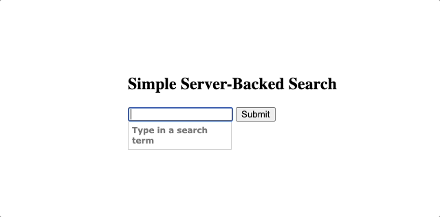

jQuery Autocomplete: An Autocomplete Text Entry
=======================================================

Overview
--------
Tokeninput is a jQuery plugin which allows your users to select multiple items from a predefined list, using autocompletion as they type to find each item. You may have seen a similar type of text entry when filling in the recipients field sending messages on facebook.
